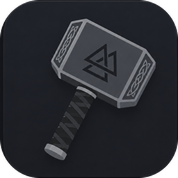

# Thor



[](https://github.com/Nov0cx/Thor/actions/workflows/windows.yml)
[](https://github.com/Nov0cx/Thor/actions/workflows/ubuntu.yml)
[](https://github.com/Nov0cx/Thor/actions/workflows/macos.yml)
[](https://github.com/Nov0cx/Thor/actions/workflows/arch.yml)
[](LICENSE)

This an editor written in [Odin](https://odin-lang.org/) with [raylib](https://pkg.odin-lang.org/vendor/raylib/v6/).

## Disclaimer

This repo is still in development, everything can break or change at any time.

## Opening a project

```bash
thor            # reopen the last session's folder
thor .          # open the folder Thor was called from
thor src/       # open that folder
thor main.odin  # open the file, with its folder as the workspace
```

Inside the editor, `File > Open Folder...` switches the workspace and
`File > Open File...` opens a file from anywhere; dropping a folder or files on
the window does the same. Each folder keeps its own session (open tabs, layout),
restored when you come back to it.

## Command Panel

Press `ctrl + .` to open the cmd panel.

## Dependencies

Thor depends on:

- [HarfBuzz](https://harfbuzz.github.io/) (via the
  [odin-harfbuzz](https://codeberg.org/mgavioli/odin-harfbuzz) bindings) for ligature shaping.
- [tree-sitter](https://tree-sitter.github.io/tree-sitter/) (via
  [odin-tree-sitter](https://github.com/laytan/odin-tree-sitter))
  for syntax highlighting.
- Lua 5.4 (Odin's bundled `vendor:lua`) for the plugin system.

### Syntax highlighting

Each language is a plugin under `plugins/<id>/plugin.lua`. Two backends:

- **tree-sitter grammars** for full languages — Odin, Lua, C, C++, Go, Jai,
  JavaScript/JSX, TypeScript, TSX, Rust, Python, Ruby, Java, Kotlin, Zig, C#,
  PHP, Haskell and OCaml. Their parsers are local build artifacts installed via
  `odin run build -- install-parser` (see [vendor/README.md](vendor/README.md));
  `syntax/syntax.odin` hard-imports each, so every grammar the source references
  must be installed before the app builds (CI installs the full list).
- **pure-Lua lexers** for config/markup formats where a grammar is overkill —
  JSON, Markdown, shell, batch and similar. These need no native build; a plugin
  just returns spans from a `highlight` function.

A project can also carry plugins of its own in `<workspace>/.thor/plugins/`.
Thor asks before it runs them, per folder, and asks even when they want no
permission. See [plugins/README.md](plugins/README.md).

Both submodules are needed, so clone with them:

```bash
git clone --recurse-submodules https://github.com/Nov0cx/Thor
```

### Windows

Two native libraries are local build artifacts, each built once per machine.
See [vendor/README.md](vendor/README.md) for both recipes:

- **HarfBuzz** into `vendor/odin-harfbuzz/libs/harfbuzz.lib` (MSVC + meson;
  `-Db_vscrt=mt` is required so it links against Odin's static CRT).
- **tree-sitter** runtime and at least one grammar into
  `vendor/odin-tree-sitter/` via the bundled `odin run build` tool.

Lua links against `lua54.dll`; the build program copies it next to the
executable from Odin's `vendor` directory the first time it is missing. Both
native libraries can also be built by `deps` below, which locates the MSVC tools
itself, so no developer shell is needed.

### Linux

The system HarfBuzz library is used; install it through your package manager
(e.g. `libharfbuzz-dev`). The tree-sitter runtime and grammars are still built
through the bundled `odin run build` tool. Lua links statically from the vendor
package, so no shared library needs copying.

## Building

`build.odin` drives everything; run it from the repository root. The editor lands
in `bin/debug` (or `bin/release`), together with `lua54.dll` and a fresh copy of
`assets/`, `plugins/` and `settings/` — Thor moves its working directory to the
executable at startup, so it loads those from beside the binary. The folder it
opens still comes from the directory it was started in.

```bash
odin run build.odin -file -- deps           # get and build HarfBuzz + tree-sitter, once
odin run build.odin -file                   # build, debug
odin run build.odin -file -- run            # build and start
odin run build.odin -file -- run -release   # build and start an optimized one
odin run build.odin -file -- check          # type-check, no binary
odin run build.odin -file -- clean
odin run build.odin -file -- -h             # list the flags
```

`run.bat` and `run.sh` are one-line wrappers for `-- run`.

## Testing
```bash
odin run build.odin -file -- test  # every package below, into bin/test
```
```bash
# or one at a time, from the repository root
odin test ui       # font/icon atlas pipeline + ligature shaping + theme loading
odin test thor     # async file load/save round-trip
odin test syntax   # tree-sitter highlighting
odin test plugin   # Lua plugin host
odin test textedit # buffer, cursors, undo/redo
odin test lang     # Odin language intelligence
odin test watch    # file-system watcher
odin test shell    # shell sessions: end markers, prompt trimming
odin test widgets  # console stream handling: control bytes, history, scrolling
```
