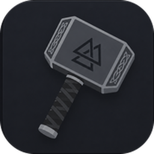

# Thor



[](https://github.com/Nov0cx/Thor/actions/workflows/windows.yml)
[](https://github.com/Nov0cx/Thor/actions/workflows/ubuntu.yml)
[](https://github.com/Nov0cx/Thor/actions/workflows/macos.yml)
[](https://github.com/Nov0cx/Thor/actions/workflows/arch.yml)
[](LICENSE)

A code editor written in [Odin](https://odin-lang.org/) with
[raylib](https://pkg.odin-lang.org/vendor/raylib/v6/). Tree-sitter syntax
highlighting, an in-client Odin language server, LSP support for every other
language, a real terminal, a built-in Git UI, image, 3D model and markdown
previews, and a sandboxed Lua plugin system.

> This repo is still in development — everything can break or change at any
> time.

## Quick start

Download a build from [Releases](https://github.com/Nov0cx/Thor/releases), or
build from source:

```bash
git clone --recurse-submodules https://github.com/Nov0cx/Thor
cd Thor
odin run build.odin -file -- deps   # once per machine: HarfBuzz + tree-sitter
odin run build.odin -file -- run    # build and start
```

Dependencies and per-platform setup: [`docs/building.md`](docs/building.md).

## Using it

Start Thor in a folder to open it as a workspace:

```bash
thor .
```

`File > Open Folder...` does the same from inside the editor, and so does
dropping a folder or files on the window. Each folder keeps its own session —
open tabs and layout — restored when you come back to it.

`ctrl + .` opens the command palette: fuzzy-search and run any action Thor has,
including everything bound to a key. **Help > Tutorial** walks through the rest
inside the editor.

## Documentation

The [`docs/`](docs/) folder is the full user manual:

- [Getting Started](docs/getting-started.md) — install, update, open a project, first tour
- [Building from Source](docs/building.md)
- [Configuration](docs/configuration.md) — settings, themes, per-project `.thor/` files
- [Keybindings](docs/keybindings.md) — every shortcut
- [Git](docs/git.md) — changes, history, branches, config, GitHub/GitLab
- [Plugins](docs/plugins.md)
- [Troubleshooting](docs/troubleshooting.md) — the log file, a slow start

For the codebase itself (architecture, package layout, contributing), see
[`CLAUDE.md`](CLAUDE.md).

## License

[GPL v3](LICENSE).
